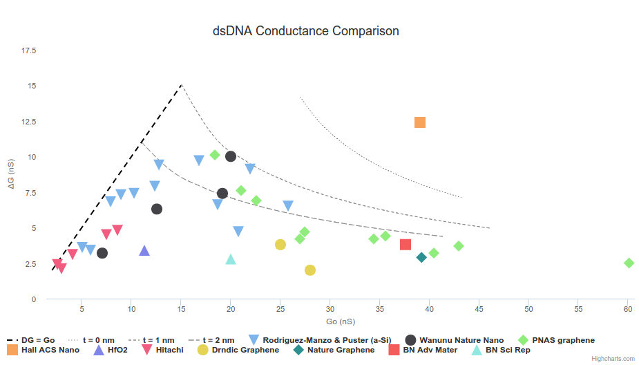

# Pore Compare
Comparison of conductance data in the solid-state nanopore literature.

Check out the site [here](http://parkin.github.io/pore-compare/).

Inspired by [DNA Translocation in nm-Thick Silicon Nanopores](http://pubs.acs.org/doi/abs/10.1021/acsnano.5b02531).

## Contributing

To add your data, please send in a pull request or [create a new issue](https://github.com/parkin/pore-compare/issues).
